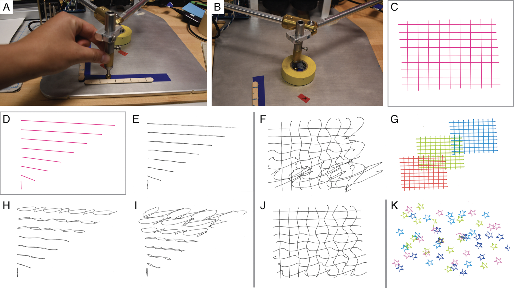

# Project 1 Proposal

## Project Title [OUR AMAZING PLOTTER]

## Idea

Briefly describe the idea for your project

## Inspiration

What existing projects (your own or the work of others) inspired you for this idea?
Include example images and videos!

Example Image

Example Video Embedding

<iframe src="https://player.vimeo.com/video/196317031?h=6e5e7b8b2e" style="position:absolute;top:0;left:0;width:100%;height:100%;" frameborder="0" allow="autoplay; fullscreen; picture-in-picture" allowfullscreen></iframe>

<a href="https://vimeo.com/196317031">Sample Vimeo Video</a> from <a href="https://vimeo.com/user123456">Vimeo User</a> on <a href="https://vimeo.com">Vimeo</a>.

## Proposed Design

Outline your proposed system and interaction. What will the machine do? What will the operator do? What do you expect the output to look like?

## Planned Implementation

Describe your plan for implementing the project, including hardware and software you intend to use. This can be basic as you are only just starting to learn Stepdance!

## Major Challenges / Questions

What are the major questions you have / what challenges do you think this project will pose?

## Materials Required

What beyond the current kit of parts do you expect to need?

---
*Replace the images above with your own, or update the file paths as needed.*
